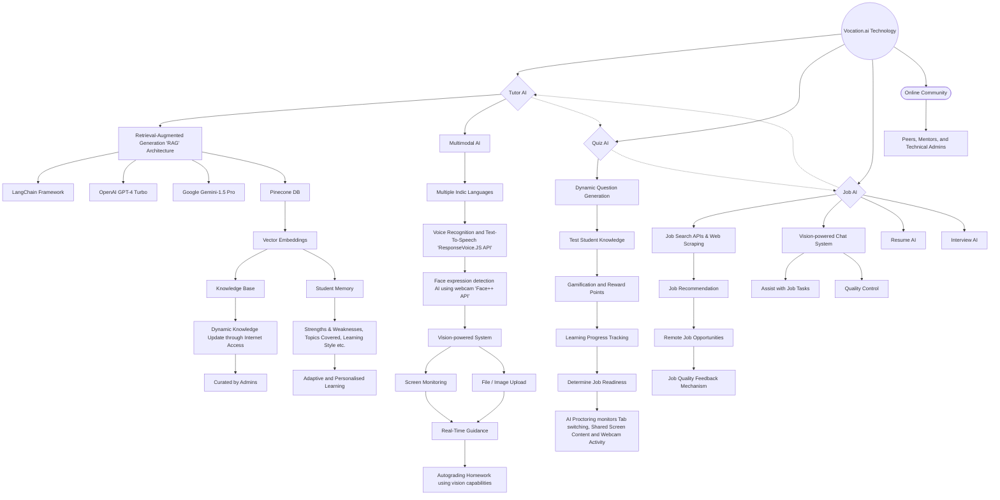

# Vocation.ai
Empowering rural India's youth through AI driven education and employment solutions. We bridge the gap between learning and earning, fostering nation's development and individual growth.

# How to use
- To see the output, use the prototype link.
- The project won't run locally as the API keys and system prompts have been removed.
- This was done to avoid unauthorized access to sensitive information and prevent plagiarism.
- However the full codebase is available for thorough review and evaluation.

# Prototype
[Try Out >](https://vocation-ai.web.app/)

# Technology

